# Magic Music APP

## 概述

此项目基于网易云API，使用Compose UI编写而成，项目整体采用MVVM架构，主要实现音视频资源播放(Media3-Exoplayer)、前台服务、歌曲下载、资源评论、歌曲解析、歌词逐行匹配等功能

## 效果预览-图片资源

> https://photos.app.goo.gl/41n5WRSf471zfLWJ9

## 效果预览-视频资源

> https://live.csdn.net/v/363120

## 功能预览

- [x] 主题
  - [x] 亮色主题
  - [x] 深色主题
  - [x] 手动切换主题样式
  - [x] 系统切换主题样式

- [x] 登录
  - [x] 手机号码登录
  - [x] 邮箱登录
  - [x] 扫码登录
- [x] 歌曲(Media3-Exoplayer)
  - [x] 歌曲播放（本地资源、网络资源）
  - [x] 歌词解析
  - [x] 歌词匹配（逐行）
  - [x] 评论歌曲
  - [x] 收藏歌曲
  - [x] 前台服务（通知栏媒体样式）
- [x] 视频(Media3-Exoplayer)
  - [x] 自定义exoplayer样式
  - [x] 视频横屏与竖屏切换
  - [x] 收藏视频
  - [x] 评论视频
  - [x] 分享视频
  - [x] 前台服务（通知栏媒体样式）
- [x] 下载(Aria)
  - [x] 歌曲下载
  - [x] 前台服务（通知栏媒体样式）
  - [x] 清空下载内容
- [x] 前台服务
  - [x] 音视频媒体通知栏样式
  - [x] 下载进度条通知栏样式
- [x] 歌单
  - [x] 歌单
  - [x] 专辑
  - [x] 电台
- [x] 搜索
  - [x] 搜索记录
  - [x] 清空搜索记录
  - [x] 搜索建议
  - [x] 热门搜索
  - [x] 搜索结果（歌曲、歌单、专辑、歌手...）
- [x] 评论
  - [x] 资源评论（歌曲、歌单、专辑...）
  - [x] 楼层评论(回复某人的评论)
  - [x] 发送评论
  - [x] 点赞评论

- [x] 收藏
- [x] 最近播放
- [x] 播放列表
- [x] 用户信息
- [x] 推荐
  - [x] 歌单推荐
  - [x] 专辑推荐
  - [x] 歌曲推荐
  - [x] 歌手推荐
- [x] 榜单

## Library

|   Library Name   | Description      |
| :--------------: | ---------------- |
| retrofit、okhttp | 用户网络请求     |
|       hilt       | 用于依赖注入     |
| media-exoplayer  | 用于音视频播放   |
|       aria       | 用于资源下载     |
|       coil       | 用于网络图片加载 |
|      pager       | 用户多页面切换   |
|     paging3      | 用户分页加载     |
|       room       | 本地资源存储     |
|       ...        | ...              |
|                  |                  |

## 部分功能实现效果图

### 登录

 

### Navigation

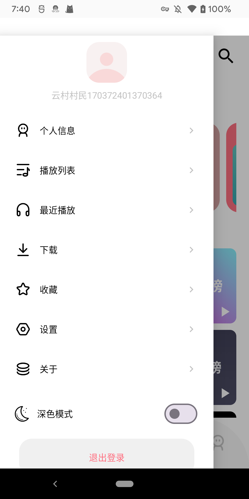

 

### 歌曲播放

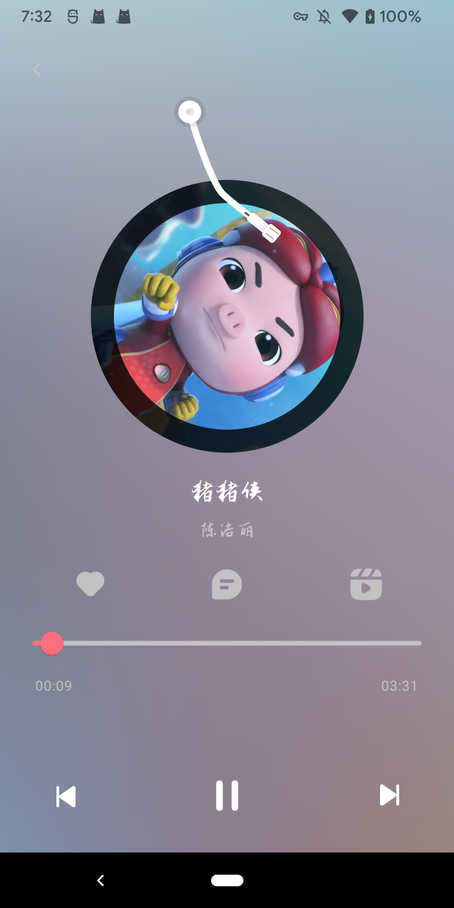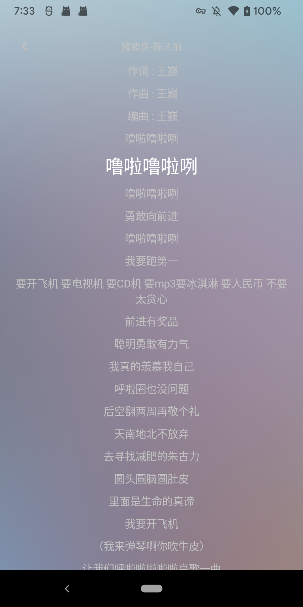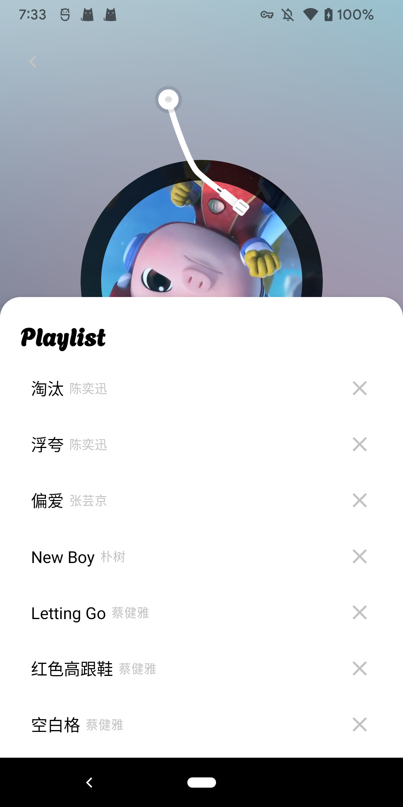

 

### 视频播放

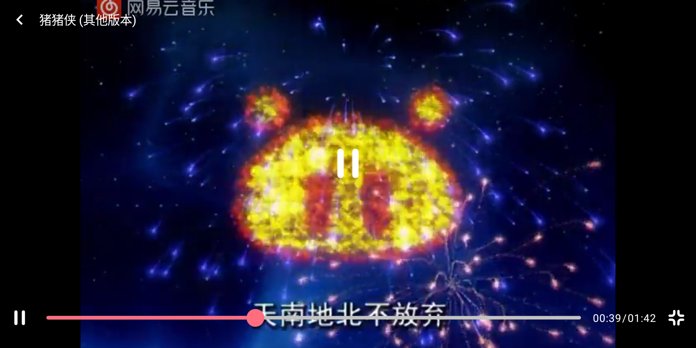

 

### 搜索

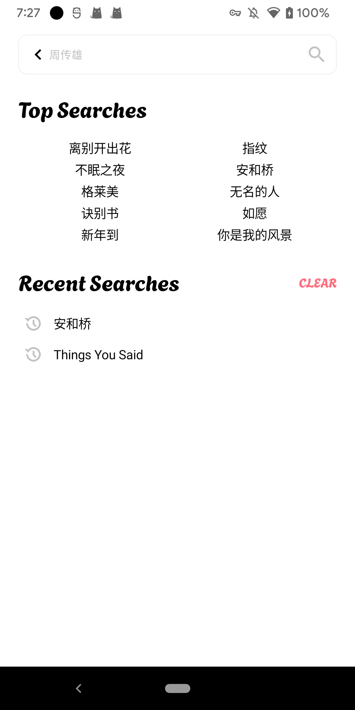

 

### 搜索结果

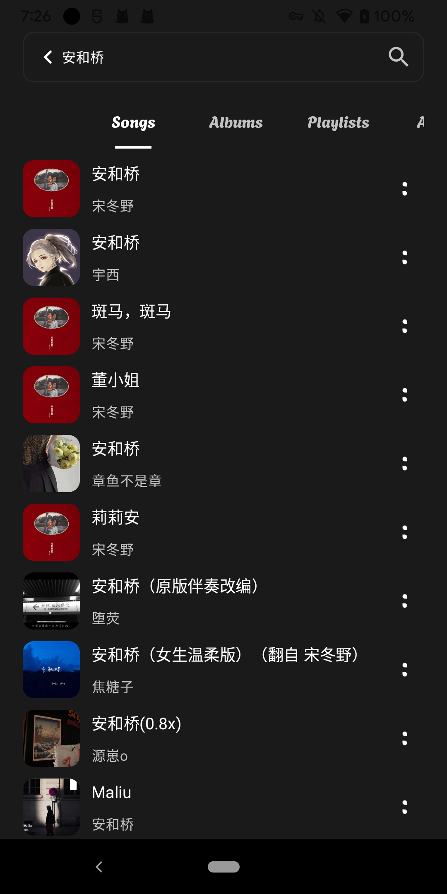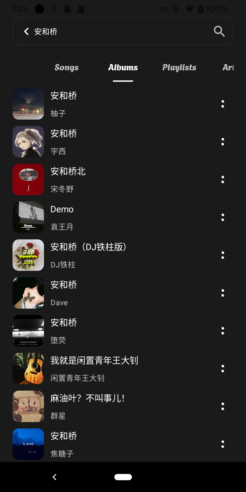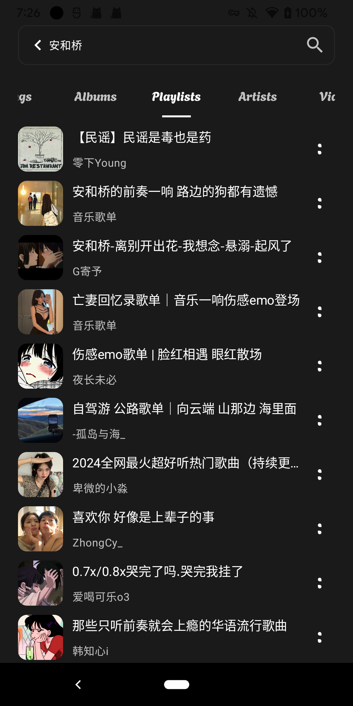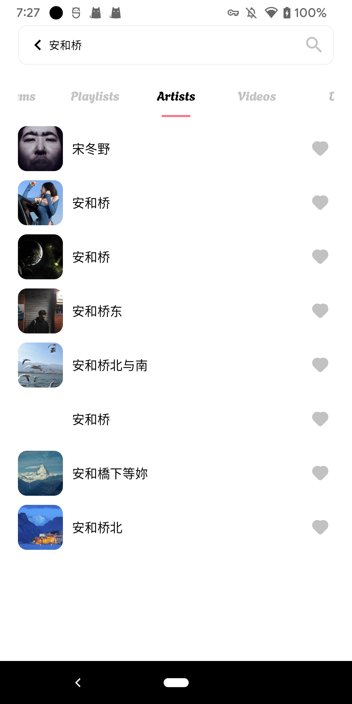

### 推荐

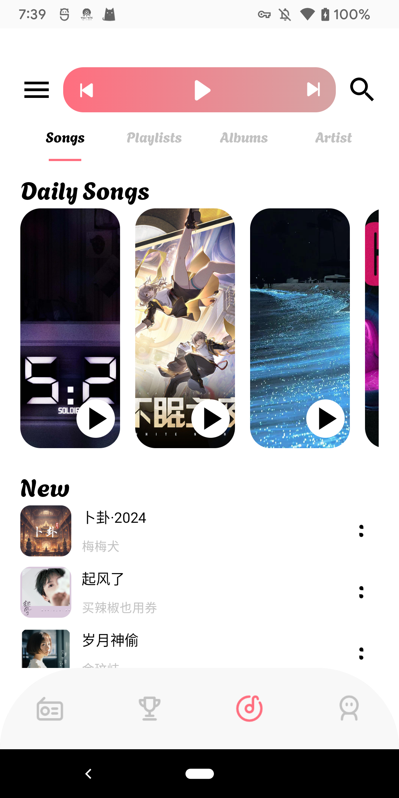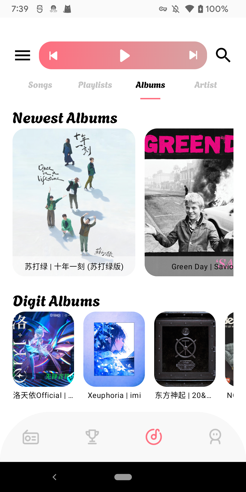

### 榜单

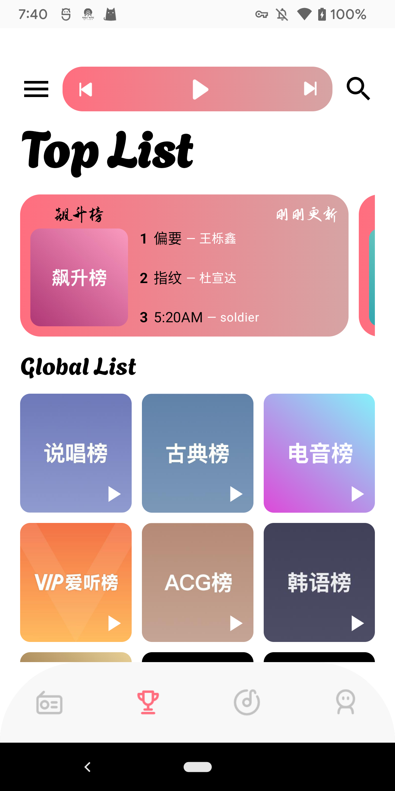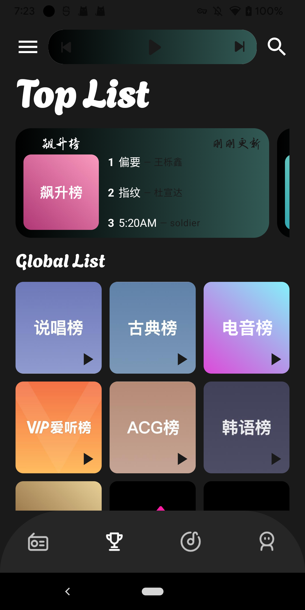

### 歌手详情

### 歌曲下载

### 评论

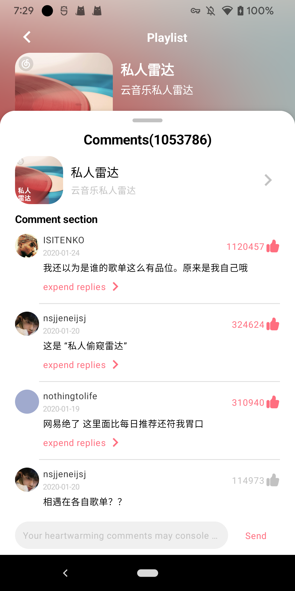

### 前台服务

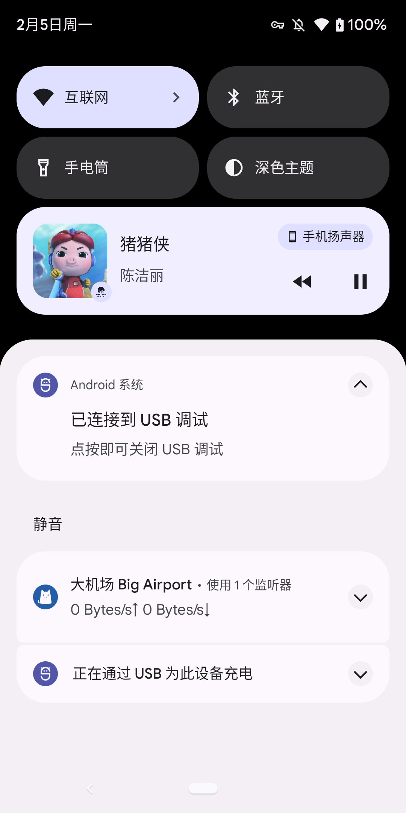

### Other

每一个页面都适配了亮色主题和深色主题，由于篇幅冗余，还有些许页面没有贴出效果图，有意者，可以点击上方图片资源或者视频资源链接进行观看！

## End

欢迎诸位issue！
